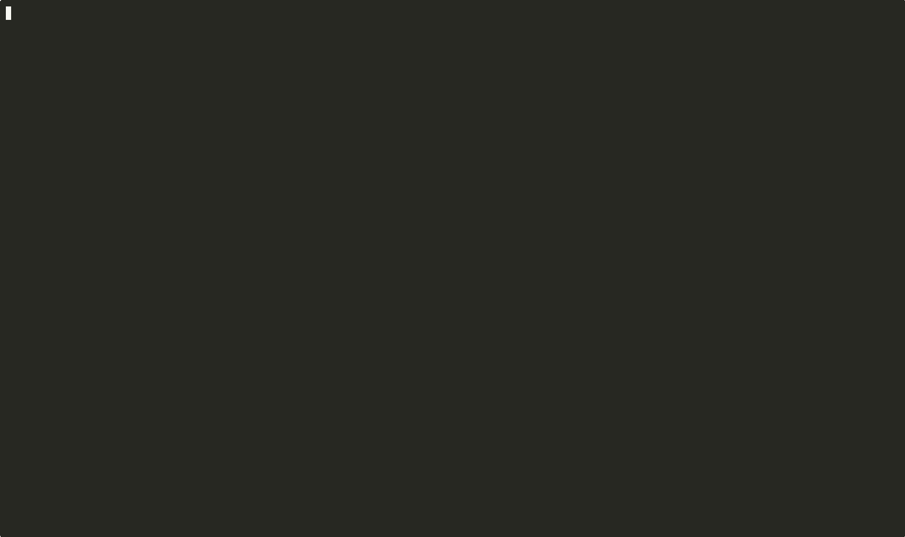

# runvoy

Run infrastructure commands without sharing credentials.

Deploy once, issue API keys, let your team execute Terraform, kubectl, and other tools safely from their terminals.

Think of Terraform Cloud without the need for a Terraform Cloud account (and monthly bill...).

Think of the flexibility of invoking `kubectl run` without the need for a Kubernetes cluster (or any other _always-running_ cluster, for that matter).

Think of running commands in an ephemeral environment and sharing execution logs like with Github Actions, but without the need for a CI/CD pipeline nor a 3rd party service.



## Overview

runvoy solves the challenge of giving team members access to run infrastructure commands (terraform, CDK, kubectl, etc.) without distributing admin credentials. Deploy once, secure forever.

**Key Benefits:**

- **No credential sharing**: Team members never see AWS credentials
- **Complete audit trail**: Every execution logged with user identification
- **Safe stateful operations**: Automatic locking prevents concurrent conflicts
- **Self-service**: Team members don't wait for admins to run commands
- **Self-hosted**: The backend runs in your AWS account, you control everything
- **Serverless**: No always-running servers, just pay for the compute your commands comsume
- **Full control**: No black magic. You can tune all the parameters, the resources are provisioned in your AWS account via CloudFormation

## Features

- **CloudFormation deployment** - Deploy complete backend infrastructure with CloudFormation templates
- **Flexible container images** - Use any Docker image (terraform, python, node, etc.)
- **API key authentication** - Secure access with hashed API keys (SHA-256)
- **Execution isolation** - Commands run in ephemeral ECS Fargate (ARM64) containers
- **CloudWatch integration** - Full execution logs and audit trails
- **Multi-user support** - Centralized execution for entire teams
- **Event-driven architecture** - Automatic execution tracking via EventBridge
- **Execution locking** - Prevent concurrent operations on shared resources (e.g., Terraform state)
- **Unix-style output streams** - Separate logs (stderr) from data (stdout) for easy piping and scripting

## Quick Start

### Prerequisites

#### CLI user

- Go 1.24 or later

#### Admin user

- Go 1.24 or later
- [just](https://github.com/casey/just) command runner
- AWS CloudFormation and AWS profile configured with admin credentials (or check `infra/cloudformation-backend.yaml` for the required permissions)

### Deploy the backend infrastructure (one time only)

This will bootstrap the backend infrastructure and seed the admin user, that is, normal users don't need to do this.

Ensure AWS credentials are configured in your shell, e.g:

```bash
export AWS_PROFILE=your-profile
export AWS_REGION=us-east-2
```

then run:

```bash
just init
```

### Install the CLI

```bash
go install cmd/runvoy
```

### User Onboarding

#### For Admin Users

If you deployed the backend infrastructure with `just init`, the admin API key and endpoint are automatically configured in `~/.runvoy/config.yaml`. You can start using runvoy immediately:

```bash
runvoy run "echo hello world"
```

or

```bash
runvoy users create <email>
```

to create a new user account for a team member.

#### For Non-Admin Users (Team Members)

When an admin creates a user account for you, they will provide you with a **claim token**. To get started:

1. **Install the CLI** (if not already installed):

   ```bash
   go install cmd/runvoy
   ```

2. **Configure the endpoint** (first time only):

   ```bash
   runvoy configure
   # When prompted, enter your API endpoint URL (provided by your admin)
   # Example: https://your-endpoint.example.com
   ```

3. **Claim your API key** using the token provided by your admin:

   ```bash
   runvoy claim <your-claim-token>
   ```

   This command will:
   - Validate the token with the backend
   - Retrieve your API key
   - Automatically save it to your local configuration file (`~/.runvoy/config.yaml`)

4. **You're ready to use runvoy!** Try running a command:

   ```bash
   runvoy run "echo hello world"
   ```

**Important Notes:**

- ⏱  Claim tokens expire after 15 minutes
- 👁  Each token can only be used once
- If your token expires or is already used, ask your admin to create a new user account for you

## Development

### Prerequisites for Development

- Go 1.24 or later
- [just](https://github.com/casey/just) command runner
- AWS credentials configured in your shell environment

### Environment Setup

First-time setup for new developers:

```bash
# Install dependencies and development tools
just dev-setup

# Install pre-commit hook
just install-hook

# Sync Lambda environment variables to local .env file
just local-dev-sync
```

### Local Development Workflow

**Run the local development server:**

```bash
# Build and run local server (rebuilds on each restart)
just run-local

# Run local server with hot reloading (rebuilds automatically on file changes)
just local-dev-server
```

**Sync environment variables from AWS:**

```bash
# Fetch current environment variables from runvoy-orchestrator Lambda and save to .env
just local-dev-sync
```

**Run tests and quality checks:**

```bash
# Run all tests
just test

# Run tests with coverage report
just test-coverage

# Lint code
just lint

# Format code
just fmt

# Run both lint and tests
just check
```

**Build and deploy:**

```bash
# Build all binaries (CLI, orchestrator, event processor, local server)
just build

# Deploy all services to AWS
just deploy

# Or deploy individual services
just deploy-orchestrator
just deploy-event-processor
just deploy-webviewer
```

**Infrastructure management:**

```bash
# Initialize complete backend infrastructure
just init

# Create/update backend infrastructure
just create-backend-infra

# Destroy backend infrastructure
just destroy-backend-infra
```

**Other useful commands:**

```bash
# Seed admin user in AWS DynamoDB
just seed-admin-user admin@example.com runvoy-backend

# Update README with latest CLI help output
just update-readme-help

# Clean build artifacts
just clean
```

For more information about the development workflow, see [Development with `just`](#development-with-just).

## Architecture

runvoy uses a serverless event-driven architecture built on AWS Lambda, ECS Fargate, DynamoDB, and EventBridge:

- **Orchestrator Lambda**: HTTPS endpoint (Function URL) for synchronous API requests
- **Event Processor Lambda**: Asynchronous event handler for ECS task completions
- **DynamoDB**: Stores API keys (hashed), execution records with status
- **ECS Fargate**: Runs commands in isolated, ephemeral ARM64 containers
- **EventBridge**: Captures ECS task state changes for completion tracking
- **CloudWatch**: Logs all executions for audit and debugging

For detailed architecture information, see [ARCHITECTURE.md](docs/ARCHITECTURE.md).

## Usage

<!-- CLI_HELP_START -->
### Available Commands

To see all available commands and their descriptions:

```bash
runvoy --help
```

```bash
runvoy - 0.1.0-20251104-f06600f
Isolated, repeatable execution environments for your commands

Usage:
  runvoy [command]

Available Commands:
  claim       Claim a user's API key
  completion  Generate the autocompletion script for the specified shell
  configure   Configure local environment with API key and endpoint URL
  help        Help about any command
  images      Images management commands
  kill        Kill a running command execution
  list        List executions
  logs        Get logs for an execution
  run         Run a command
  status      Get the status of a command execution
  users       User management commands
  version     Show the version of the CLI

Flags:
      --debug            Enable debugging logs
  -h, --help             help for runvoy
      --timeout string   Timeout for command execution (e.g., 10m, 30s, 1h) (default "10m")
      --verbose          Verbose output

Use "runvoy [command] --help" for more information about a command.
```

For more details about a specific command, use:

```bash
runvoy [command] --help
```

For example, to see all user management commands:

```bash
runvoy users --help
```

<!-- CLI_HELP_END -->

### Common Commands Examples

**Command Execution:**

```bash
runvoy run <command...>

# Example
runvoy run --git-repo https://github.com/mycompany/myproject.git npm run tests
# Output:
# 🚀 runvoy
# ━━━━━━━━━━━━━━━━━━━━━━━━━━━━━━━━━━━━━━━━━━━━━━━━━━
# → Running command: npm run tests
# ✓ Command execution started successfully
#   Execution ID: 61fb9138466c4212b1e0d763a7f4dfe2
#   Status: RUNNING
# → View logs in web viewer: https://runvoy-releases.s3.us-east-2.amazonaws.com/webviewer.html?execution_id=61fb9138466c4212b1e0d763a7f4dfe2
```

**Log Viewing:**

```bash
runvoy logs <executionID>

# Example
runvoy logs 72f57686926e4becb89116b0ac72caec

# Default behavior
# - Waits until the execution starts (spinner)
# - Prints all available logs once, then exits

# Sample output
🚀 runvoy
━━━━━━━━━━━━━━━━━━━━━━━━━━━━━━━━━━━━━━━━━━━━━━━━━━
→ Getting logs for execution: 72f57686926e4becb89116b0ac72caec
⠋ Waiting for execution to start...

Line  Timestamp (UTC)      Message
────  ───────────────────  ───────────────────────────────────────────────────────
1     2025-10-30 13:32:48  Runvoy Runner execution started by requestID 1234567890
2     2025-10-30 13:32:48  terraform plan
3     2025-10-30 13:32:49  Refreshing Terraform state in-memory prior to plan...
...
✓ Logs retrieved successfully
→ View logs in web viewer: https://runvoy-releases.s3.us-east-2.amazonaws.com/webviewer.html?execution_id=72f57686926e4becb89116b0ac72caec
```

**Web Viewer:**

In addition to the CLI, you can view logs in a browser using the web viewer. The CLI automatically provides a web viewer link when you run a command:

```bash
runvoy run "echo hello world"
# Output includes:
# View logs in web viewer: https://runvoy-releases.s3.us-east-2.amazonaws.com/webviewer.html?execution_id=72f57686926e4becb89116b0ac72caec
```

The web viewer is a minimal, single-page application that provides:

- **Real-time log streaming** - Automatically polls for new logs every 5 seconds
- **ANSI color support** - Displays colored terminal output
- **Status tracking** - Shows execution status (RUNNING, SUCCEEDED, FAILED, STOPPED)
- **Execution metadata** - Displays execution ID, start time, and exit codes
- **Interactive controls**:
  - Pause/Resume polling
  - Download logs as text file
  - Clear display
  - Toggle metadata (line numbers and timestamps)

**Setup (first-time only):**

1. Open the web viewer URL in your browser
2. Enter your API endpoint URL (same as in `~/.runvoy/config.yaml`)
3. Enter your API key (same as in `~/.runvoy/config.yaml`)
4. Settings are saved in browser's localStorage for future use

The web viewer is hosted on AWS S3 by default, but you can configure a custom URL if you deploy your own instance (see Configuration below).

**Configuration:**

The web viewer URL can be customized via:
- Environment variable: `RUNVOY_WEBVIEWER_URL`
- Config file (`~/.runvoy/config.yaml`): `webviewer_url` field

If not configured, it defaults to `https://runvoy-releases.s3.us-east-2.amazonaws.com/webviewer.html`.

**User Management:**

```bash
# Create a new user
runvoy users create <email>

# Example
runvoy users create alice@example.com
# Output:
# 🚀 runvoy
# ━━━━━━━━━━━━━━━━━━━━━━━━━━━━━━━━━━━━━━━━━━━━━━━━━━
# → Creating user with email alice@example.com...
# ✓ User created successfully
#   Email: alice@example.com
#   Claim Token: abc123def456...
#
# ℹ Share this command with the user => runvoy claim abc123def456...
#
# ⏱  Token expires in 15 minutes
# 👁  Can only be viewed once

# List all users
runvoy users list

# Example output:
# 🚀 runvoy
# ━━━━━━━━━━━━━━━━━━━━━━━━━━━━━━━━━━━━━━━━━━━━━━━━━━
# → Listing users…
#
# Email                  Status    Created (UTC)        Last Used (UTC)
# ─────────────────────  ────────  ───────────────────  ───────────────────
# admin@example.com      Active    2025-10-30 10:00:00  2025-11-02 14:30:00
# alice@example.com      Active    2025-11-01 09:15:00  2025-11-02 12:45:00
# bob@example.com        Revoked   2025-10-28 16:20:00  2025-10-29 08:10:00
#
# ✓ Users listed successfully

# Revoke a user's API key
runvoy users revoke <email>

# Example
runvoy users revoke bob@example.com
```

### Output Streams and Piping

runvoy follows Unix conventions by separating informational messages from data output, making it easy to pipe commands and script automation workflows:

- **stderr (standard error)**: Runtime messages, progress indicators, and logs
  - Informational messages (→, ✓, ⚠, ✗)
  - Progress spinners and status updates
  - Headers and UI formatting

- **stdout (standard output)**: Actual data from API responses
  - Tables, lists, and structured data
  - Raw output for piping to other tools

**Examples:**

```bash
# Hide informational messages, show only data
runvoy list 2>/dev/null

# Hide data, show only logs/status messages
runvoy list >/dev/null

# Pipe data to another command (jq, grep, etc.)
runvoy list 2>/dev/null | grep "RUNNING"

# Redirect logs and data to separate files
runvoy list 2>status.log >executions.txt

# Pipe between runvoy commands
runvoy command1 2>/dev/null | runvoy command2

# Use in scripts with proper error handling
if runvoy status $EXEC_ID 2>/dev/null | grep -q "SUCCEEDED"; then
  echo "Execution succeeded"
fi
```

This separation enables clean automation and integration with other Unix tools without mixing informational output with parseable data.

### Global Flags

All commands support the following global flags:

- `--timeout <duration>` - Timeout for command execution (default: `10m`, e.g., `30s`, `1h`, `600`)
- `--verbose` - Enable verbose output
- `--debug` - Enable debugging logs

Example:

```bash
runvoy --verbose --timeout 5m users create alice@example.com
```

### Environment Configuration

The `.env` file is automatically created when you run `just init` or `just local-dev-sync`. The `local-dev-sync` command syncs environment variables from the runvoy-orchestrator Lambda function to your local `.env` file for development.

### Development with `just`

The repository ships with a `justfile` to streamline common build, deploy, and QA flows. The default recipe (`just runvoy`) rebuilds the CLI before running any arguments you pass through, so you can quickly exercise commands locally:

```bash
# equivalent to: go build ./cmd/runvoy && ./bin/runvoy logs <id>
just runvoy logs <execution-id>
```

Key targets, grouped by workflow:

- **Build & run**: `just build` (all binaries), `just build-cli`, `just build-local`, `just run-local` (local HTTP server with freshly built binary)
- **Deploy artifacts**: `just deploy` (all), `just deploy-orchestrator`, `just deploy-event-processor`, `just deploy-webviewer`
- **Quality gates**: `just test`, `just test-coverage`, `just lint`, `just lint-fix`, `just fmt`, `just check`, `just clean`
- **Environment setup**: `just dev-setup`, `just install-hook`
- **Infrastructure helpers**: `just create-lambda-bucket`, `just update-backend-infra`, `just destroy-backend-infra`
- **Operational tooling**: `just seed-admin-user`, `just local-dev-server` (hot reloading)
- **Miscellaneous**: `just record-demo` (captures CLI demo as cast and GIF)

All commands honor the environment variables described in the `justfile`; AWS credentials and profiles must already be configured in your shell.

### CLI Installation

1. Clone the repository:

```
