# runvoy Architecture

The following diagram shows the major components and their interactions:


## Folder Structure

```text
runvoy/
├── bin/
├── cmd/
├── deploy/
├── docs/
├── internal/
│   ├── app/
│   │   ├── orchestrator/     # Command execution and API orchestration
│   │   ├── processor/        # Event processing (CloudWatch, ECS, WebSocket)
│   │   └── websocket/        # WebSocket connection management
│   ├── providers/            # Cloud provider implementations (AWS)
│   ├── server/               # HTTP routing and handlers
│   ├── auth/                 # Authentication logic
│   ├── client/               # CLI client implementations
│   ├── config/               # Configuration loading
│   ├── constants/            # Constants and typed definitions
│   ├── errors/               # Error types and handling
│   ├── logger/               # Logging utilities
│   └── ...                   # Other internal packages
├── scripts/
```

- `bin/`: built binaries for the runvoy application (temporary storage for building artifacts during development).
- `cmd/`: main entry points for the various application (CLI, local dev server, provider-specific lambdas, etc.)
- `deploy/`: infrastructure as code grouped by provider (CloudFormation templates, etc.).
- `docs/`: project documentation (architecture, testing strategy, etc.).
- `internal/`: core logic of the runvoy application:
  - `app/`: main application container with subcomponents:
    - `orchestrator/`: synchronous API request handling and command execution orchestration
    - `processor/`: asynchronous event processing from AWS services (EventBridge, CloudWatch Logs, WebSocket lifecycle)
    - `websocket/`: WebSocket connection management and message routing (used by both orchestrator and processor)
  - `providers/`: cloud provider-specific implementations (currently AWS)
  - `server/`: HTTP routing, middleware, and handlers for the API
  - Other packages: authentication, client libraries, configuration, logging, error handling, etc.
- `scripts/`: scripts for the runvoy application development and deployment

## Services

- Orchestrator: Handles API requests and orchestrates task executions.
- Event Processor: Handles asynchronous events from cloud services (ECS task completions, CloudWatch logs, WebSocket notifications, etc.).

## Execution Provider Abstraction

To support multiple cloud platforms, the service layer now depends on an execution provider interface:

```text
internal/backend/orchestrator.Service → uses Runner interface (provider-agnostic)
internal/providers/aws/orchestrator   → AWS-specific implementation (ECS Fargate)
```

**Architecture:**

- `internal/backend/orchestrator/init.go` defines the `Service` type and `Initialize()` function for the core orchestrator
- `internal/providers/aws/orchestrator/` contains all AWS-specific implementations:
  - `runner.go` - ECS task execution
  - `images_dynamodb.go` - Docker image management
  - `taskdef.go` - ECS task definitions
  - `logs.go` - CloudWatch logs access
  - `client.go`, `context.go`, `scripts.go`, `tags.go` - AWS SDK adapters and utilities
- The `Runner` interface abstracts starting a command execution and returns a stable execution ID and the task creation timestamp
- Clients import directly from `internal/backend/orchestrator` (not via `internal/backend`)
- AWS provider is wired in `internal/backend/orchestrator/init.go` via `internal/providers/aws/orchestrator.Initialize()`

## Router Architecture

The application uses **chi** (github.com/go-chi/chi/v5) as the HTTP router for both Lambda and local HTTP server orchestrator implementations. This provides a consistent routing API across deployment models.

### Components

- **`internal/server/router.go`**: Shared chi-based router configuration with all API routes
- **`internal/server/middleware.go`**: Middleware for request ID extraction and logging context
- **`internal/providers/aws/lambdaapi/handler.go`**: Lambda handler that uses algnhsa to adapt the chi router
- **`cmd/local/main.go`**: Local HTTP server implementation using the same router
- **`cmd/backend/providers/aws/orchestrator/main.go`**: Lambda entry point for the orchestrator (uses the chi-based handler)

### Route Structure

All routes are defined in `internal/server/router.go`:

```text
GET    /api/v1/health                      - Health check (public)
GET    /api/v1/claim/{token}               - Claim a pending API key (public)
POST   /api/v1/health/reconcile            - Reconcile orchestrator health probes (auth)
POST   /api/v1/run                         - Start an execution (auth)
GET    /api/v1/users                       - List all users (auth)
POST   /api/v1/users/create                - Create a new user with a claim URL (auth)
POST   /api/v1/users/revoke                - Revoke a user's API key (auth)
GET    /api/v1/images                      - List registered container images (auth)
POST   /api/v1/images/register             - Register a new container image (auth)
GET    /api/v1/images/{imagePath...}       - Inspect a registered image entry (auth)
DELETE /api/v1/images/{imagePath...}       - Remove a registered image (auth)
GET    /api/v1/secrets                     - List stored secrets (auth)
POST   /api/v1/secrets                     - Create a new secret (auth)
GET    /api/v1/secrets/{name}              - Retrieve a secret (auth)
PUT    /api/v1/secrets/{name}              - Update a secret (auth)
DELETE /api/v1/secrets/{name}              - Delete a secret (auth)
GET    /api/v1/executions                  - List executions (auth)
GET    /api/v1/executions/{id}/logs        - Fetch execution logs (auth)
GET    /api/v1/executions/{id}/status      - Get execution status (auth)
DELETE /api/v1/executions/{id}             - Terminate a running execution (auth)
GET    /api/v1/trace/{requestID}           - Query backend infrastructure logs by request ID (admin)
```

Both Lambda and local HTTP server use identical routing logic, ensuring development/production parity.

### Lambda Event Adapter

The platform uses **algnhsa** (`github.com/akrylysov/algnhsa`), an open-source library that adapts standard Go `http.Handler` implementations (like chi routers) to work with AWS Lambda. This eliminates the need for custom adapter code and provides robust support for multiple Lambda event types.

**Implementation:** `internal/providers/aws/lambdaapi/handler.go` creates the Lambda handler by wrapping the chi router with `algnhsa.New()`:

```go
func NewHandler(svc *app.Service, requestTimeout time.Duration) lambda.Handler {
    router := server.NewRouter(svc, requestTimeout)
    return algnhsa.New(router.Handler(), nil)
}
```

### Middleware Stack

The router uses a middleware stack for cross-cutting concerns:

1. **Content-Type Middleware**: Sets `Content-Type: application/json` for all responses
2. **Request ID Middleware**: Extracts AWS Lambda request ID and adds it to logging context
3. **Authentication Middleware**: Validates API keys and adds user context
4. **Authorization Middleware**: Enforces role-based access control via Casbin before handlers are invoked
5. **Request Logging Middleware**: Logs incoming requests and their responses with method, path, status code, and duration

**Authentication Middleware Error Handling:**

- Invalid API key → 401 Unauthorized (INVALID_API_KEY)
- Revoked API key → 401 Unauthorized (API_KEY_REVOKED)
- Database failures during authentication → 503 Service Unavailable (DATABASE_ERROR)
- This ensures database errors are properly distinguished from authentication failures

**Post-Authentication Behavior:**

- On successful authentication, the system asynchronously updates the user's `last_used` timestamp in the API keys table (best-effort; failures are logged and do not affect the request).

The request ID middleware automatically:

- Extracts the AWS Lambda request ID from the Lambda context when available
- Adds the request ID to the request context for use by handlers
- Falls back gracefully when not running in Lambda environment

### Authorization and Access Control

runvoy uses **Casbin-based Role-Based Access Control (RBAC)** to enforce authorization across all API endpoints. This is layered on top of authentication to ensure users can only perform actions they are explicitly permitted to do.

#### Role Definitions

Four predefined roles control access to different resources:

1. **Admin**: Full access to all resources and operations
2. **Operator**: Can manage images, secrets, and execute commands; cannot manage users
3. **Developer**: Can create and manage their own resources; can execute commands
4. **Viewer**: Read-only access to resources

#### Authorization Enforcement Points

**Middleware-Based Authorization:**

- Authorization is enforced at the middleware level, before handlers are invoked
- The authorization middleware automatically maps HTTP methods and paths to authorization actions:
  - `GET` → `read` action
  - `POST` → `create` action
  - `PUT` → `update` action
  - `DELETE` → `delete` action
- Enforces role-based permissions via Casbin RBAC model
- Returns `403 Forbidden` with `FORBIDDEN` error code when access is denied
- Returns `401 Unauthorized` with `UNAUTHORIZED` error code when unauthenticated
- Handlers no longer need to check authorization; it's handled centrally by middleware

**Resource-Level Authorization (Special Case: `/api/v1/run` Endpoint):**

- The execution endpoint (`POST /api/v1/run`) validates access to all referenced resources before starting an execution:
  - **Image Access**: User must have read permission on `/api/images` to use a specified image
  - **Secret Access**: User must have read permission on `/api/secrets` for each secret referenced
- This ensures users cannot execute with resources they don't have access to
- Validation happens in the handler layer via `ValidateExecutionResourceAccess()` method, before calling the service

#### Resource Ownership

For fine-grained access control, resources track ownership:

- **Secrets**: The creator is marked as owner during creation (`created_by`), and the `owned_by` list is initialized with the creator. Ownership entries are removed when a secret is deleted (runtime updates keep the enforcer in sync).
- **Executions**: The executor is marked as creator (`created_by`), and the `owned_by` list is initialized with the creator. Ownerships are hydrated at startup and immediately recorded every time a new execution record is created.
- **Images**: The user who registers an image is marked as creator (`created_by`), and the `owned_by` list is initialized with the creator.
- All resources maintain a `created_by` field (immutable, set at creation) and an `owned_by` list (can be modified to add/remove owners).
- Owners can access their resources with full permissions via the resource-owner (g2) matcher in Casbin.
- Ownership mappings hydrate at startup and are refreshed continuously as secrets/executions change so long-lived processes stay accurate, even outside Lambda.

#### Authorization Data Flow

1. **Initialization**: At service startup, all user roles are loaded from the database into the Casbin enforcer
2. **Request Processing**:
   - Authentication middleware validates API key and adds user to context
   - Authorization middleware automatically maps HTTP method + path to action and checks permission via Casbin
   - If authorized, request proceeds to handler; if denied, request is rejected with `403 Forbidden`
   - For `/run` endpoint: After general `create` permission check in middleware, handler layer validates access to specific resources (image, secrets) via `ValidateExecutionResourceAccess()`
3. **Access Denied**: Request is rejected at middleware level with appropriate HTTP status and error code before handlers are invoked
4. **Runtime Sync**:
   - User role assignments are pushed to the enforcer when users are created or revoked.
   - Ownership mappings are updated live for both secrets (create/delete) and executions (creation), removing the need to rely on process restarts.

The following diagram illustrates the complete authorization flow:

```mermaid
flowchart TD
    Start([Incoming API Request]) --> Auth{Authentication<br/>Middleware}
    Auth -->|Invalid/Revoked| Unauth[Return 401<br/>UNAUTHORIZED]
    Auth -->|Valid API Key| LoadUser[Load User Context<br/>from DynamoDB]
    LoadUser --> Authz{Authorization<br/>Middleware}

    Authz --> MapAction[Map HTTP Method to Action<br/>GET→read, POST→create<br/>PUT→update, DELETE→delete]
    MapAction --> CasbinCheck{Casbin Enforcer<br/>Check Permission}

    CasbinCheck -->|Check Role| RoleMatch{User has<br/>required role?}
    CasbinCheck -->|Check Ownership| OwnerMatch{User owns<br/>resource?}

    RoleMatch -->|Yes| Authorized[Authorized]
    OwnerMatch -->|Yes| Authorized
    RoleMatch -->|No| CheckOwner{Check<br/>Ownership?}
    CheckOwner -->|Yes| OwnerMatch
    CheckOwner -->|No| Forbidden[Return 403<br/>FORBIDDEN]
    OwnerMatch -->|No| Forbidden

    Authorized --> IsRunEndpoint{Is /api/v1/run<br/>endpoint?}
    IsRunEndpoint -->|No| Handler[Proceed to Handler]
    IsRunEndpoint -->|Yes| ValidateResources[Validate Resource Access<br/>- Check image access<br/>- Check secrets access]

    ValidateResources -->|All Accessible| Handler
    ValidateResources -->|Access Denied| Forbidden

    Handler --> Success[Return 200/201<br/>SUCCESS]

    style Auth fill:#e1f5ff
    style Authz fill:#e1f5ff
    style CasbinCheck fill:#ffe1e1
    style Authorized fill:#e1ffe1
    style Forbidden fill:#ffe1e1
    style Unauth fill:#ffe1e1
    style Success fill:#e1ffe1
```



#### Casbin Model and Policies

The RBAC model is defined in `internal/auth/authorization/casbin/model.conf` with:

- **Request Definition**: `(subject, object, action)` - e.g., `(user@example.com, /api/images, read)`
- **Role Definition**: Two grouping relationships:
  - `g`: User-to-role mapping (e.g., `user@example.com` has role `role:admin`)
  - `g2`: Resource-to-owner mapping (e.g., `secret:secret-123` is owned by `user@example.com`)
- **Matcher**: Allows access if user has required role OR if user is the resource owner

Policies are embedded in the binary at build time from `internal/auth/authorization/casbin/policy.csv`.

### Execution Records: Compute Platform, and Request ID

- The service includes the request ID (when available) in execution records created in `internal/backend/orchestrator.Service.RunCommand()`.
- The `request_id` is persisted in DynamoDB via the `internal/providers/aws/database/dynamodb` repository.
- If a request ID is not present (e.g., non-Lambda environments), the service logs a warning and stores the execution without a `request_id`.
- The `compute_platform` field in execution records is derived from the configured backend provider at initialization time (e.g., `AWS`) rather than being hardcoded in the service logic.
- The backend provider is selected via the `RUNVOY_BACKEND_PROVIDER` configuration value (default: `AWS`); provider-specific bootstrapping logic determines which runner and repositories are wired in.

### Execution ID Uniqueness and Write Semantics

- Execution records are written with a conditional create to ensure no overwrite occurs for an existing execution item.
- DynamoDB `PutItem` uses a `ConditionExpression` preventing creation when a record with the same composite key (`execution_id`, `started_at`) already exists.
- On conditional failure, the API surfaces a 409 Conflict (via `ErrConflict`).
- Note: The system creates a single record per `execution_id`. If future designs require multiple items per `execution_id`, a separate uniqueness guard pattern would be needed.

## Logging Architecture

The application uses a unified logging approach with structured logging via `log/slog`:

### Logger Initialization

- Logger is initialized once at application startup in `internal/logger/logger.go`
- Configuration supports both development (human-readable) and production (JSON) formats
- Log level is configurable via `RUNVOY_LOG_LEVEL` environment variable

### Service-Level Logging

- Each `Service` instance in `internal/backend/orchestrator` contains its own logger instance (`Service.Logger`)
- Service methods that receive a `context.Context` derive a request-scoped logger using the Lambda request ID when available: `reqLogger := s.Logger.With("request_id", AwsRequestID)`
- This keeps logs consistent with router/handler logs and ensures traceability across layers

### Request-Scoped Logging

- A helper `logger.DeriveRequestLogger(ctx, base)` builds a request-scoped logger from context
- Currently extracts AWS Lambda request ID; future providers can be added centrally
- Router/handlers, services, and repositories use this helper to keep logs consistently tagged

### Request Logging Middleware

- **Automatic Request Logging**: The request logging middleware automatically logs all incoming requests
- Logs include: HTTP method, path, remote address, status code, and request duration
- Both incoming requests and completed responses are logged for complete request lifecycle visibility
- Implementation: `internal/server/router.go` lines 115-153
- The middleware uses a response writer wrapper to capture response status codes and measure execution time
- Remote address is automatically available in both local and Lambda executions via the Lambda adapter

### Database Layer Logging

- Database repositories receive the base service logger during initialization
- Repository methods derive a request-scoped logger from the call context (when a Lambda request ID is present) so their logs include `requestID`
- This maintains consistent, end-to-end traceability for a request across middleware, handlers, services, and repositories

### Benefits

- **Consistency**: All logging uses the same logger instance and format
- **Simplicity**: No need for `GetLoggerFromContext()` or global logger access
- **Traceability**: Request ID is automatically included in all request-scoped logs
- **Maintainability**: Clear separation between service-level and request-scoped logging

## System Architecture

The following diagram illustrates the complete system architecture with all AWS services, data flows, and client interactions:

```mermaid
graph TB
    subgraph Clients["Users"]
        CLI["🖥️ CLI Client<br/>(with API Key)"]
        Browser["🌐 Web Browser<br/>(with API Key)"]
    end

    subgraph AWS["AWS Account"]
        subgraph API["API Layer"]
            FunctionURL["Lambda Function URL<br/>(HTTPS Entry Point)"]
            WebSocketAPI["API Gateway<br/>WebSocket API"]
        end

        subgraph Compute["Compute"]
            Orchestrator["⚡ Orchestrator Lambda<br/>- Validate API key<br/>- Check resource locks<br/>- Start ECS tasks<br/>- Record executions"]
            EventProc["⚡ Event Processor Lambda<br/>- Route ECS events<br/>- Process CloudWatch logs<br/>- Handle WebSocket lifecycle<br/>- Trigger health checks"]
            ECS["🐳 ECS Fargate<br/>- Sidecar: git setup<br/>- Runner: execute command<br/>- Stream stdout/stderr"]
        end

        subgraph Storage["Storage & Data"]
            DDB["📦 DynamoDB<br/>- API Keys<br/>- Executions<br/>- Images<br/>- Secrets Metadata<br/>- WebSocket Connections"]
            CW["📋 CloudWatch Logs<br/>- Container output<br/>- Execution logs"]
            SSM["🔐 Parameter Store<br/>- Secret values<br/>Encrypted with KMS"]
        end

        subgraph Events["Event Routing"]
            EventBridge["🎯 EventBridge<br/>- ECS task completions<br/>- Health check schedules<br/>- CW log subscriptions"]
        end

        subgraph Security["Security"]
            IAM["🔑 IAM Roles<br/>- Task roles<br/>- Exec roles"]
            KMS["🔐 KMS Key<br/>- Encrypt secrets"]
        end
    end

    subgraph External["External / Client-Hosted"]
        WebViewer["🌍 Web Viewer<br/>(S3-hosted or external)<br/>- Real-time log streaming<br/>- ANSI color support<br/>- Status tracking<br/>- LocalStorage auth"]
    end

    %% Client connections
    CLI -->|HTTPS + X-API-Key| FunctionURL
    Browser -->|HTTPS + X-API-Key| FunctionURL
    CLI -->|WebSocket| WebSocketAPI
    Browser -->|WebSocket| WebSocketAPI

    %% API Layer routing
    FunctionURL --> Orchestrator
    WebSocketAPI --> EventProc

    %% Orchestrator data flows
    Orchestrator -->|Read/Write| DDB
    Orchestrator -->|Start tasks| ECS
    Orchestrator -->|Write secrets| SSM
    Orchestrator -->|Query| DDB

    %% ECS execution
    ECS -->|Stream logs| CW
    ECS -->|Task completion| EventBridge
    ECS -->|Task role| IAM

    %% Event processing
    EventBridge -->|Invoke with<br/>task events| EventProc
    CW -->|Subscription| EventProc
    EventProc -->|Update status<br/>Update locks| DDB
    EventProc -->|Push logs to<br/>connections| WebSocketAPI
    EventProc -->|Health<br/>reconciliation| ECS

    %% Client access to logs and status
    DDB -->|Query connections| EventProc
    DDB -->|Store WebSocket<br/>connection metadata| DDB

    %% Security integration
    SSM -->|Encrypted with| KMS
    DDB -->|Encrypted with| KMS
    IAM -->|Assume role| Orchestrator
    IAM -->|Assume role| EventProc
    IAM -->|Assume role| ECS

    %% Web viewer access
    Browser -->|View logs via| WebViewer
    WebViewer -->|Poll status| FunctionURL
    WebViewer -->|Stream logs via| WebSocketAPI

    %% Styling
    style Orchestrator fill:#e1f5ff
    style EventProc fill:#e1f5ff
    style ECS fill:#ffe1e1
    style DDB fill:#e1ffe1
    style WebSocketAPI fill:#fff3e0
    style EventBridge fill:#fff3e0
    style FunctionURL fill:#f3e5f5
    style Clients fill:#fce4ec
    style External fill:#e0f2f1
```



**Key Data Flows:**

1. **Command Execution**: CLI/Browser → Function URL → Orchestrator → DynamoDB (store execution) → ECS (start task)
2. **Log Streaming**: ECS → CloudWatch Logs → (subscription) → Event Processor → WebSocket API → CLI/Browser
3. **Task Completion**: ECS → EventBridge → Event Processor → DynamoDB (update status) → WebSocket (notify clients)
4. **Secret Management**: Orchestrator ↔ DynamoDB (metadata) ↔ Parameter Store (encrypted values)
5. **Health Reconciliation**: EventBridge (scheduled) → Event Processor → ECS/DynamoDB/IAM (verify & repair)

**Note:** The system uses two Lambda functions (Orchestrator and Event Processor) to separate synchronous API requests from asynchronous event handling, enabling independent scaling and clear separation of concerns.

### Execution Flow Sequence

The following sequence diagram shows the complete execution lifecycle from command submission to completion:


## Event Processor Architecture

The platform uses a dedicated **event processor Lambda** to handle asynchronous events from AWS services. This provides a clean separation between synchronous API requests (handled by the orchestrator) and asynchronous event processing.

### Design Pattern

- **Orchestrator Lambda**: Handles synchronous HTTP API requests
- **Event Processor Lambda**: Handles asynchronous workloads from EventBridge, CloudWatch Logs subscriptions, and API Gateway WebSocket lifecycle events
- Both Lambdas are independent, scalable, and focused on their specific domain

### Event Processing Flow

1. **ECS Task Completion**: When an ECS Fargate task stops, AWS generates an "ECS Task State Change" event
2. **EventBridge Filtering**: EventBridge rule captures STOPPED tasks from the runvoy cluster only
3. **Lambda Invocation**: EventBridge invokes the event processor Lambda with the task details
4. **Event Routing**: The processor routes events by type (extensible for future event types)
5. **Data Extraction**:
   - Execution ID extracted from task ARN (last segment)
   - Exit code from container details
   - Timestamps for start/stop times
6. **DynamoDB Update**: Execution record updated with:
   - Final status (SUCCEEDED, FAILED, STOPPED)
   - Exit code
   - Completion timestamp
   - Duration in seconds
7. **WebSocket Disconnect Notification**: When execution reaches a terminal status, the event processor reuses the WebSocket manager to notify connected clients and clean up connections without invoking a separate Lambda
8. **CloudWatch Logs Streaming**: CloudWatch Logs subscription events deliver batched runner log entries; the processor converts them to `api.LogEvent` records and pushes each entry to active WebSocket connections
9. **WebSocket Lifecycle**: `$connect` and `$disconnect` routes from API Gateway are handled in-process to authenticate clients, persist connection metadata, and fan out disconnect messages
10. **Scheduled Health Checks**: EventBridge scheduled events trigger health reconciliation to verify and repair inconsistencies between DynamoDB metadata and AWS resources

### Event Types

Currently handles:

- **ECS Task State Change**: Updates execution records when tasks complete
- **CloudWatch Logs Subscription**: Streams runner container logs to connected clients in real time
- **API Gateway WebSocket Events**: Manages `$connect` and `$disconnect` routes

Designed to be extended for future event types, such as:

- CloudWatch Alarms
- S3 events
- Custom application events

### Implementation

**Entry Point**: `cmd/backend/providers/aws/processor/main.go`

- Initializes event processor from `internal/backend/processor`
- Starts Lambda handler

**Event Routing**: `internal/backend/processor/backend.go`

- Routes events by `detail-type`
- Ignores unknown event types (log and continue)
- Extensible switch statement for new handlers

**AWS Provider Implementation**: `internal/providers/aws/processor/backend.go`

- Parses ECS task events
- Extracts execution ID from task ARN
- Determines final status from exit code and stop reason
- Handles missing `startedAt` timestamps: When ECS task events have an empty `startedAt` field (e.g., when containers fail before starting, such as sidecar git puller failures), falls back to the execution's `StartedAt` timestamp that was set at creation time
- Calculates duration (with safeguards for negative durations)
- Updates DynamoDB execution record
- Signals WebSocket termination: When execution reaches a terminal status (SUCCEEDED, FAILED, STOPPED), calls `NotifyExecutionCompletion()` which sends disconnect notifications to all connected clients and cleans up connection records

### Status Determination Logic

```go
switch stopCode {
case "UserInitiated":
    status = "STOPPED"    // Manual termination
case "EssentialContainerExited":
    if exitCode == 0:
        status = "SUCCEEDED"
    else:
        status = "FAILED"
case "TaskFailedToStart":
    status = "FAILED"
}
```

### Execution Status Types

Runvoy defines two distinct status type systems:

1. **ExecutionStatus** (`constants.ExecutionStatus`): Business-level execution status used throughout the API
   - `STARTING`: Command accepted and infrastructure provisioning in progress
   - `RUNNING`: Command is currently executing
   - `SUCCEEDED`: Command completed successfully (exit code 0)
   - `FAILED`: Command failed with an error (non-zero exit code)
   - `STOPPED`: Command was manually terminated by user
   - `TERMINATING`: Stop requested, waiting for task to fully stop

2. **EcsStatus** (`constants.EcsStatus`): AWS ECS task lifecycle status returned by ECS API
   - `PROVISIONING`, `PENDING`, `ACTIVATING`, `RUNNING`, `DEACTIVATING`, `STOPPING`, `DEPROVISIONING`, `STOPPED`
   - These are used internally for ECS task management and should not be confused with execution status

Execution status values are defined as typed constants in `internal/constants/constants.go` to ensure consistency across the codebase and as part of the API contract. This prevents typos and makes the valid status values explicit to developers.

### Error Handling

- **Orphaned Tasks**: Tasks without execution records are logged and skipped (no failure)
- **Parse Errors**: Malformed events are logged and returned as errors
- **Database Errors**: Failed updates are logged and returned as errors (Lambda retries)
- **Unknown Events**: Unhandled event types are logged and ignored

### Benefits

- ✅ **Event-Driven**: No polling, near real-time updates (< 1 second)
- ✅ **Cost-Efficient**: Only pay for Lambda invocations on events
- ✅ **Scalable**: Handles any event volume automatically
- ✅ **Extensible**: Easy to add new event handlers without infrastructure changes
- ✅ **Reliable**: EventBridge guarantees at-least-once delivery
- ✅ **Separation of Concerns**: Sync API vs async events

## Health Manager Architecture

The health manager provides automated reconciliation of resources between DynamoDB metadata and actual AWS services. It ensures consistency across ECS task definitions, SSM parameters (secrets), and IAM roles.

### Purpose

Resources managed by runvoy are stored in two places:

1. **DynamoDB**: Metadata about images, secrets, and their configurations
2. **AWS Services**: Actual resources (ECS task definitions, SSM parameters, IAM roles)

The health manager periodically checks for inconsistencies and repairs them when possible:

- **Recreatable resources** (ECS task definitions): Automatically recreated from DynamoDB metadata
- **Non-recreatable resources** (SSM parameters without values, missing IAM roles): Reported as errors requiring manual intervention
- **Orphaned resources**: Resources that exist in AWS but not in DynamoDB are reported but not deleted
- **Casbin Authorization**: Expose missing information about Casbin resources in DynamoDB records

### Components

1. **Health Manager Interface** (`internal/backend/health/health.go`):
   - Defines `health.Manager` interface with `Reconcile(ctx) (*health.Report, error)` method
   - Provider-agnostic interface similar to `websocket.Manager` pattern
   - `Report` structure contains comprehensive status for ECS, secrets, and IAM

2. **AWS Health Manager** (`internal/providers/aws/health/manager.go`):
   - Implements health checks for ECS task definitions, SSM parameters, and IAM roles
   - Recreates missing ECS task definitions using stored metadata
   - Updates tags to match DynamoDB state
   - Reports orphaned resources and errors

3. **Task Definition Recreation** (`internal/providers/aws/ecsdefs`):
   - Shared ECS task definition utilities decoupled from orchestrator
   - `RecreateTaskDefinition()`: Recreates a task definition from metadata
   - `UpdateTaskDefinitionTags()`: Updates tags to match expected state

4. **Orchestrator Integration** (`internal/backend/orchestrator/health.go`):
   - `ReconcileResources()` method on orchestrator Service
   - Allows synchronous execution via API (future API endpoint)

5. **Event Processor Integration** (`internal/providers/aws/processor/backend.go`):
   - Handler for EventBridge scheduled events (cron-like)
   - Invokes health manager reconciliation automatically

### Reconciliation Strategy

#### ECS Task Definitions

- For each image in DynamoDB:
  - Verify task definition exists in ECS (via family name)
  - If missing: Recreate using stored metadata (image, CPU, memory, roles, runtime platform)
  - Verify tags match (IsDefault, DockerImage, Application, ManagedBy)
  - If tags differ: Update tags to match DynamoDB state
- Scan ECS for orphaned task definitions (family matches `runvoy-image-*` but not in DynamoDB)
  - Report orphans (don't delete automatically to avoid data loss)

#### SSM Parameters (Secrets)

- For each secret in DynamoDB:
  - Verify parameter exists in SSM Parameter Store
  - If missing: **Error** (cannot recreate without value)
  - Verify tags match (Application, ManagedBy)
  - If tags differ: Update tags
- Scan SSM for orphaned parameters (under secrets prefix but not in DynamoDB)
  - Report orphans (don't delete automatically)

#### IAM Roles

- Verify default roles exist (`DefaultTaskRoleARN`, `DefaultTaskExecRoleARN`)
  - If missing: **Error** (managed by CloudFormation)
- For each image in DynamoDB:
  - If `task_role_name` specified: Verify role exists
  - If `task_execution_role_name` specified: Verify role exists
  - If missing: **Error** (cannot recreate without policies)

### Error Handling

- **Recreatable resources** (ECS task definitions): Recreate and continue
- **Non-recreatable resources** (SSM parameters without values, missing IAM roles): Return error in report
- **Secret access errors**: Already handled in `SecretsRepository.RetrieveSecret`, but health check marks as unhealthy
- Collect all errors and return comprehensive report

### Health Report Structure

The `Report` contains:

- `Timestamp`: When the reconciliation ran
- `ECSStatus`: Counts of verified, recreated, tag-updated, and orphaned task definitions
- `SecretsStatus`: Counts of verified, tag-updated, missing, and orphaned parameters
- `IAMStatus`: Verification status for default and custom roles
- `Issues`: Array of `Issue` objects with resource type, ID, severity, message, and action taken
- `ReconciledCount`: Total number of resources reconciled (recreated + tag updates)
- `ErrorCount`: Total number of errors found

### Scheduled Execution

Health reconciliation can be triggered:

1. **Scheduled**: Via EventBridge scheduled events (cron-like) - configured in CloudFormation. Scheduled events must provide a JSON payload with `{"runvoy_event": "health_reconcile"}` so the processor can safely distinguish runvoy health checks from other scheduled invocations. By default it's running every hour.
2. **Manual**: Via orchestrator `ReconcileResources()` method (`/health/reconcile` API endpoint)

### Design Decisions

1. **Shared access pattern**: Health manager is accessed from both orchestrator and event processor, similar to `websocket.Manager`
2. **Recreation logic reuse**: Task definition registration logic extracted to reusable functions
3. **No automatic deletion**: Orphaned resources are reported but not deleted to prevent data loss
4. **Comprehensive error reporting**: All issues collected and returned in structured report
5. **Idempotent operations**: Health checks can run multiple times safely

### CloudFormation Resources

- **`EventProcessorRole`**: IAM role with DynamoDB, ECS, and API Gateway Management API permissions
- **`EventProcessorLogGroup`**: CloudWatch Logs for event processor
- **`TaskCompletionEventRule`**: EventBridge rule filtering ECS task completions
- **`EventProcessorEventPermission`**: Permission for EventBridge to invoke Lambda
- **`EventProcessorLogsPermission`**: Allows CloudWatch Logs to invoke the event processor
- **`HealthCheckEventRule`**: EventBridge scheduled rule for periodic health reconciliation (optional, to be added)
- **`RunnerLogsSubscription`**: Subscribes ECS runner logs (filtered to the `runner` container streams) to the event processor for real-time processing
- **`SecretsMetadataTable`**: DynamoDB table tracking metadata for managed secrets (name, description, env var binding, audit timestamps)
- **`SecretsKmsKey`**: KMS key dedicated to encrypting secret payloads stored as SecureString parameters
- **`SecretsKmsKeyAlias`**: Friendly alias pointing to the secrets KMS key for CLI and configuration usage

## Secrets Management

Runvoy includes a first-party secrets store so admins can centralize credentials that executions or operators need. Secret payloads never live in the database; they are written to AWS Systems Manager Parameter Store as SecureString parameters encrypted with a dedicated KMS key, while descriptive metadata is persisted separately in DynamoDB for fast queries and auditing.

### Components

- **Metadata repository (`SecretsMetadataTable`)**: DynamoDB table keyed by `secret_name`. Stores the environment variable binding (`key_name`), description, ownership fields (`created_by`, `owned_by`), and audit fields (`created_at`, `updated_by`, `updated_at`). Conditional writes prevent accidental overwrites.
- **Value store (Parameter Store)**: Secrets are persisted under the configurable prefix (default `/runvoy/secrets/{name}`) using SecureString entries encrypted with `SecretsKmsKey`. Every rotation creates a new Parameter Store version while the CLI/API always surfaces the latest value.
- **Dedicated KMS key**: CloudFormation provisions a scoped CMK and alias for secrets. Lambda execution roles have permission to encrypt/decrypt with this key only for the configured prefix.

### API and CLI Workflow

All secrets endpoints require authentication via the standard `X-API-Key` header.

1. **Create (`POST /api/v1/secrets`)**: The orchestrator stores the value in Parameter Store first and then records metadata in DynamoDB. On metadata failure, it performs best-effort cleanup of the value to avoid orphans.
2. **Read (`GET /api/v1/secrets/{name}`)**: Returns metadata plus the decrypted value. Missing Parameter Store values are logged and surfaced as metadata-only responses.
3. **List (`GET /api/v1/secrets`)**: Scans the metadata table, then hydrates values from Parameter Store in best effort fashion. The CLI formats the result as a table without echoing secret payloads.
4. **Update (`PUT /api/v1/secrets/{name}`)**: Rotates the value (if provided) by overwriting the Parameter Store entry and refreshes metadata, including the optional `key_name` change.
5. **Delete (`DELETE /api/v1/secrets/{name}`)**: Removes the SecureString entry and then deletes the metadata record. Missing payloads are tolerated so cleanup is idempotent.

### Operational Characteristics

- **Auditability**: Metadata captures who created or updated a secret and when. CLI output highlights those fields so teams can spot stale or orphaned credentials.
- **Prefix isolation**: The orchestrator only writes inside the configured prefix, ensuring teams can segregate secrets per environment (e.g., `/runvoy/prod/secrets` vs `/runvoy/dev/secrets`).
- **Error handling**: Parameter Store failures surface as `500` errors. DynamoDB conditional failures map to conflict/not-found errors so the CLI can react appropriately.
- **Infrastructure integration**: `just init` provisions the metadata table, KMS key, and IAM policies. Environment variables (`RUNVOY_AWS_SECRETS_PREFIX`, `RUNVOY_AWS_SECRETS_KMS_KEY_ARN`, `RUNVOY_AWS_SECRETS_METADATA_TABLE`) keep the orchestrator configuration explicit across environments.

## WebSocket Architecture

The platform uses WebSocket connections for real-time log streaming to clients (CLI and web viewer). The architecture consists of two main components: the event processor Lambda (reusing the WebSocket manager package) and the API Gateway WebSocket API.

### Design Pattern

- **Event Processor Lambda**: Handles WebSocket connection lifecycle events, streams CloudWatch log batches, and issues disconnect notifications via the WebSocket manager package
- **CloudWatch Logs subscription**: Invokes the event processor whenever runner container logs are produced, allowing it to push log events to all active connections
- **API Gateway WebSocket API**: Provides WebSocket endpoints for client connections

### Components

#### WebSocket Manager Package

**Purpose**: Manages WebSocket connection lifecycle and sends disconnect notifications when executions complete. It is embedded inside the event processor Lambda rather than deployed as a separate Lambda function.

**Implementation**: `internal/backend/websocket/manager.go` (interface), `internal/providers/aws/websocket/manager.go` (AWS implementation)

- **`HandleRequest(ctx, rawEvent, logger)`**: Adapts raw Lambda events for the generic processor, routes WebSocket events by route key, and reports whether the event was handled

**Route Keys Handled**:

1. **`$connect`** (`handleConnect`):
   - Stores WebSocket connection in DynamoDB with execution ID
   - Sets TTL for connection record (24 hours by default)
   - Returns success response

2. **`$disconnect`** (`handleDisconnect`):
   - Removes WebSocket connection from DynamoDB when client disconnects
   - Cleans up connection record

**Connection Management**:

- Connections stored in DynamoDB `{project-name}-websocket-connections` table
- Each connection record includes: `connection_id`, `execution_id`, `functionality`, `expires_at`
- Connections are queried by execution ID for log forwarding

#### API Gateway WebSocket API

**Configuration**: Defined in CloudFormation template (`deploy/providers/aws/cloudformation-backend.yaml`)

**Routes**:

- **`$connect`**: Routes to the event processor Lambda
- **`$disconnect`**: Routes to the event processor Lambda

**Integration**:

- Uses AWS_PROXY integration type
- Both routes integrate with the event processor Lambda
- API Gateway Management API used for sending messages to connections

### Execution Completion Flow

When an execution reaches a terminal status (SUCCEEDED, FAILED, STOPPED):

1. **Event Processor** (`internal/providers/aws/processor/backend.go`):
   - Updates execution record in DynamoDB with final status
   - Calls `NotifyExecutionCompletion()`
   - Queries DynamoDB for all connections for the execution ID
   - Sends disconnect notification message to all connections using `api.WebSocketMessage` type (format: `{"type":"disconnect","reason":"execution_completed"}`)
   - Deletes all connection records from DynamoDB
   - Uses concurrent sending for performance

2. **Clients** (CLI or web viewer):
   - Receive disconnect notification message
   - Close WebSocket connection gracefully
   - Stop polling/log streaming

### Connection Lifecycle

**Connection Establishment**:

1. CLI or web viewer calls `GET /api/v1/executions/{id}/logs`; the service creates a reusable WebSocket token and returns a `wss://` URL containing `execution_id` and `token` query parameters
2. Client connects to the returned WebSocket URL
3. API Gateway routes the `$connect` event to the event processor Lambda
4. Lambda validates the token (which persists for reuse), stores the connection record in DynamoDB, and the connection becomes ready for streaming

**Token Reusability**:

- Tokens are **reusable** and persist until expiration via TTL (`constants.ConnectionTTLHours`)
- If a client's WebSocket connection drops, it can reconnect using the same token without calling `/logs` again
- This enables seamless reconnection for transient network issues
- Once the token expires (24 hours by default), clients must call `/logs` again to get a new token

**Log Streaming**:

1. CloudWatch Logs invokes the event processor with batched runner log events
2. The event processor transforms each entry into an `api.LogEvent` and sends it to every active WebSocket connection for that execution in real time

**Connection Termination**:

- **Manual disconnect**: Client closes connection → API Gateway routes `$disconnect` → Lambda removes connection record via the embedded WebSocket manager
- **Execution completion**: Event processor calls `NotifyExecutionCompletion()` → Lambda notifies clients and deletes records via the embedded WebSocket manager
- **Token expiration**: After TTL expires, pending token is automatically deleted; client must call `/logs` to reconnect

### Error Handling

- **Connection failures**: Failed sends are logged but don't fail the Lambda handler
- **Missing connections**: If no connections exist for an execution, operations return successfully
- **Concurrent sending**: Uses error group with rate limiting to prevent overwhelming API Gateway
- **Best-effort notifications**: Disconnect notifications are best-effort; failures don't prevent execution completion

### Benefits

- ✅ **Real-time Streaming**: Logs appear instantly in clients without polling
- ✅ **Efficient**: Only forwards logs when clients are connected
- ✅ **Scalable**: Handles multiple concurrent connections per execution
- ✅ **Clean Termination**: Clients are notified when executions complete
- ✅ **Automatic Cleanup**: Connection records are cleaned up on execution completion

### CloudFormation Resources

- **`WebSocketApi`**: API Gateway WebSocket API
- **`WebSocketApiStage`**: WebSocket API stage
- **`WebSocketConnectRoute`**: `$connect` route
- **`WebSocketDisconnectRoute`**: `$disconnect` route
- **`WebSocketConnectionsTable`**: DynamoDB table for connection records

## Web Viewer Architecture

The platform includes a minimal web-based log viewer for visualizing execution logs in a browser. This provides an alternative to the CLI for teams who prefer a graphical interface.

### Implementation

**Location**: `cmd/webapp/dist/index.html`
**Deployment**: Hosted on Netlify at `https://runvoy.site/`
**Architecture**: Single-page application (SPA) - standalone HTML file with embedded CSS and JavaScript

### Technology Stack

- **Frontend**: Vanilla JavaScript + HTML5
- **Styling**: Pico.css v2 (CSS framework) - adopted in commit d04515b for improved UI and responsiveness
- **State Management**: Client-side (localStorage + JavaScript variables)
- **Polling**: 5-second intervals for logs and status updates
- **API Integration**: Fetch API for RESTful API calls

### Core Features

1. **Real-time Log Streaming**
   - Connects to WebSocket API for real-time log streaming
   - Also polls API every 5 seconds for new logs as fallback
   - Auto-scrolls to bottom on new logs
   - Handles rate limiting and backpressure
   - Receives disconnect notifications when execution completes

2. **ANSI Color Support**
   - Parses and displays colored terminal output
   - Maintains terminal formatting in the browser

3. **Status Tracking**
   - Displays execution status (RUNNING, SUCCEEDED, FAILED, STOPPED)
   - Shows execution metadata (ID, start time, exit codes)
   - Updates in real-time as execution progresses

4. **Interactive Controls**
   - Pause/Resume polling
   - Download logs as text file
   - Clear display
   - Toggle metadata (line numbers and timestamps)

5. **Authentication**
   - API endpoint URL configuration
   - API key authentication (stored in localStorage)
   - First-time setup wizard
   - Persistent credentials across sessions

### API Endpoints Used

The web viewer interacts with multiple API endpoints:

**REST API Endpoints**:

- `GET /api/v1/executions/{id}/status` - Fetch execution status and metadata
- `GET /api/v1/executions/{id}/logs` - Fetch execution logs and WebSocket URL

**`/logs` Response Contract**:
The `/logs` endpoint returns:

- `execution_id`: The execution identifier
- `status`: Current execution status (RUNNING, SUCCEEDED, FAILED, STOPPED)
- `events`: Array of completed log entries
- `websocket_url`: URL for real-time log streaming (only present if available)

Clients should check the `status` field to determine behavior:

- **RUNNING**: WebSocket URL will be present; client should connect to stream new logs in real-time
- **SUCCEEDED/FAILED/STOPPED**: Execution has completed; all logs are in the `events` array; client should not attempt WebSocket connection

**WebSocket API**:

- Connects to WebSocket URL returned in logs response
- Receives real-time log events via WebSocket (only for RUNNING executions)
- Receives disconnect notification when execution completes

All endpoints require authentication via `X-API-Key` header.

### Access Pattern

Users access the web viewer via URL with execution ID as query parameter:

`https://runvoy.site/?execution_id={executionID}`

The CLI automatically provides this link when running commands (see `cmd/cli/cmd/logs.go`).

### Configuration

The web application URL is configurable and can be set via:

1. **Environment Variable**: `RUNVOY_WEB_URL`
2. **Config File**: `web_url` field in `~/.runvoy/config.yaml`

If not configured, it defaults to `https://runvoy.site/`.

**Default URL** is defined in `internal/constants/constants.go`:

```go
const DefaultWebURL = "https://runvoy.site/"
```

**Usage in CLI commands** (see `cmd/cli/cmd/run.go` and `cmd/cli/cmd/logs.go`):

```go
output.Infof("View logs in web viewer: %s?execution_id=%s", cfg.WebURL, executionID)
```

This allows users to deploy their own web viewer instance and configure the CLI to point to it.

### Browser Requirements

- Modern browser with Fetch API support
- JavaScript enabled
- localStorage support (for persistent configuration)

## Error Handling System

The application uses a structured error handling system (`internal/errors`) that distinguishes between client errors (4xx) and server errors (5xx), ensuring proper HTTP status codes are returned.

### Error Types

**Client Errors (4xx):**

- `ErrUnauthorized` (401): General unauthorized access
- `ErrInvalidAPIKey` (401): Invalid API key provided
- `ErrAPIKeyRevoked` (401): API key has been revoked
- `ErrNotFound` (404): Resource not found
- `ErrConflict` (409): Resource conflict (e.g., user already exists)
- `ErrBadRequest` (400): Invalid request parameters

**Server Errors (5xx):**

- `ErrInternalError` (500): Internal server errors
- `ErrDatabaseError` (503): Database/transient service failures

### Error Structure

All errors are wrapped in `AppError` which includes:

- `Code`: Programmatic error code (e.g., `INVALID_API_KEY`, `DATABASE_ERROR`)
- `Message`: User-friendly error message
- `StatusCode`: HTTP status code to return
- `Cause`: Underlying error (for error wrapping)

### Error Propagation

**Database Layer (`internal/providers/aws/database/dynamodb`):**

- DynamoDB errors are wrapped as `ErrDatabaseError` (503 Service Unavailable)
- Conditional check failures (e.g., user already exists) become `ErrConflict` (409)
- User not found scenarios return `nil` user (not an error)

**Service Layer (`internal/backend`):**

- Validates input and returns appropriate client errors (400, 401, 404, 409)
- Propagates database errors as-is (preserving 503 status codes)
- Maps business logic failures to appropriate error types

**HTTP Layer (`internal/server`):**

- Extracts status codes from errors using `GetStatusCode()`
- Extracts error codes using `GetErrorCode()`
- Returns structured error responses with codes in JSON

### Key Distinction: Database Errors vs Authentication Failures

**Critical Behavior:**

- Database errors during authentication (e.g., DynamoDB unavailable) → **503 Service Unavailable**
- Invalid or revoked API keys → **401 Unauthorized**
- This prevents database failures from being misinterpreted as authentication failures

**Example Flow:**

1. User provides API key
2. Database query fails (network timeout) → Returns 503 Service Unavailable
3. User provides invalid API key → Database query succeeds but user not found → Returns 401 Unauthorized

### Error Response Format

All error responses follow this JSON structure:

```json
{
  "error": "Error message",
  "code": "ERROR_CODE",
  "details": "Detailed error information"
}
```

The `code` field is optional and provides programmatic error codes for clients.

## CLI Client Architecture

The CLI client (`cmd/cli`) provides command-line access to the runvoy platform.

### Configuration

The CLI stores configuration in `~/.runvoy/config.yaml`:

```yaml
api_endpoint: "https://your-function-url.lambda-url.us-east-1.on.aws"
api_key: "your-api-key-here"
```

Configuration is loaded once in the root command's `PersistentPreRunE` hook and stored in the command context. All commands retrieve the config from the context using the `getConfigFromContext()` helper function. This ensures config is only loaded once per command invocation and provides a consistent way to access configuration across all commands.

The config is stored in the context with the key `constants.ConfigCtxKey` (of type `constants.ConfigCtxKeyType` to avoid collision with other context keys).

### Generic HTTP Client Architecture

The CLI uses a generic HTTP client abstraction (`internal/client`) that can be reused across all commands, providing a simple and consistent way to make API requests.

#### Package Structure

- **`internal/client/client.go`**: Generic HTTP client for all API operations
- **`internal/user/client.go`**: User-specific operations using the generic client

#### Generic Client (`internal/client/client.go`)

The generic client provides a simple abstraction for all API operations:

- **`Client`**: Contains configuration and logger instances
- **`Do()`**: Makes raw HTTP requests and returns response data
- **`DoJSON()`**: Makes requests and automatically unmarshals JSON responses
- **Error Handling**: Standardized error parsing for all API responses
- **Logging**: Consistent request/response logging across all commands

#### Command-Specific Clients

Each command type has its own client that uses the generic client:

- **`internal/user/client.go`**: User management operations (create, revoke, etc.)
- **Future clients**: `internal/exec/client.go`, `internal/logs/client.go`, etc.

**Benefits:**

- **Consistency**: All commands use the same HTTP client logic
- **Simplicity**: New commands only need to define their specific operations
- **Maintainability**: HTTP client logic is centralized and reusable
- **Testability**: Generic client can be easily mocked for testing

#### Client Interface for Testing

The `internal/client/client.go` package defines an `Interface` type (`internal/client/interface.go`) that abstracts all client operations. This enables dependency injection and makes CLI commands fully testable with mocks:

- **Location**: `internal/client/interface.go`
- **Implementation**: The `Client` struct automatically implements `Interface` via compile-time check
- **Benefits**: Commands can use `client.Interface` type instead of concrete `*client.Client` for dependency injection

**Usage in Commands:**

```go
// In command handler
var c client.Interface = client.New(cfg, slog.Default())

// In service (for testing)
type StatusService struct {
    client client.Interface  // Can be mocked in tests
    output OutputInterface
}
```

#### CLI Command Testing Architecture

All CLI commands have been refactored to use a **service pattern** with dependency injection for testability. This separates business logic from cobra command handlers.

**Design Pattern:**

```12:50:cmd/cli/cmd/status.go
func statusRun(cmd *cobra.Command, args []string) {
 executionID := args[0]
 cfg, err := getConfigFromContext(cmd)
 if err != nil {
  output.Errorf("failed to load configuration: %v", err)
  return
 }

 c := client.New(cfg, slog.Default())
 service := NewStatusService(c, NewOutputWrapper())
 if err := service.DisplayStatus(cmd.Context(), executionID); err != nil {
  output.Errorf(err.Error())
 }
}

// StatusService handles status display logic
type StatusService struct {
 client client.Interface
 output OutputInterface
}

// NewStatusService creates a new StatusService with the provided dependencies
func NewStatusService(client client.Interface, output OutputInterface) *StatusService {
 return &StatusService{
  client: client,
  output: output,
 }
}

// DisplayStatus retrieves and displays the status of an execution
func (s *StatusService) DisplayStatus(ctx context.Context, executionID string) error {
 status, err := s.client.GetExecutionStatus(ctx, executionID)
 if err != nil {
  return fmt.Errorf("failed to get status: %w", err)
 }
```

**Key Components:**

1. **Output Interface** (`cmd/cli/cmd/output_interface.go`):
   - Defines `OutputInterface` for all output operations including `Prompt()` for interactive commands
   - Provides `outputWrapper` that implements the interface using global `output.*` functions
   - Enables capturing and verifying output in tests

2. **Service Pattern**:
   - Each command has an associated service (e.g., `StatusService`, `ClaimService`, `UsersService`)
   - Services contain business logic separated from cobra integration
   - Services accept dependencies via constructor injection

3. **Configuration Interfaces**:
   - `ConfigSaver` - Interface for saving configuration (used by `claim.go`)
   - `ConfigLoader` - Interface for loading configuration (used by `configure.go`)
   - `ConfigPathGetter` - Interface for getting config path (used by `configure.go`)

4. **Manual Mocking**:
   - Tests use manual mocks that implement `client.Interface` and `OutputInterface`
   - Mocks are simple structs with function fields for test-specific behavior
   - No external mocking framework required

**Testing Example:**

```go
func TestStatusService_DisplayStatus(t *testing.T) {
    mockClient := &mockClientInterface{}
    mockClient.getExecutionStatusFunc = func(ctx context.Context, executionID string) (*api.ExecutionStatusResponse, error) {
        return &api.ExecutionStatusResponse{
            ExecutionID: "exec-123",
            Status:      "running",
        }, nil
    }

    mockOutput := &mockOutputInterface{}
    service := NewStatusService(mockClient, mockOutput)

    err := service.DisplayStatus(context.Background(), "exec-123")
    assert.NoError(t, err)
    assert.True(t, len(mockOutput.calls) > 0)
}
```

## ECS Task Architecture

The platform uses dynamically managed ECS Fargate task definitions with a sidecar pattern. Task definitions are registered on-demand via the API when images are added, eliminating the need for CloudFormation-managed task definitions.

### Task Definition Management

**Task Definition Naming and Storage:**

- Task definitions follow the naming pattern `runvoy-image-{sanitized-image-name}`
  - Example: Image `hashicorp/terraform:1.6` creates task definition family `runvoy-image-hashicorp-terraform-1-6`
  - Image names are sanitized to comply with ECS task definition family name requirements (alphanumeric, hyphens, underscores only)
- **Docker image storage**: The actual Docker image is stored in the task definition container definition (runner container's `Image` field)
  - This is the source of truth - the exact image name used at runtime
  - Images are extracted from container definitions when listing (reliable, no lossy reconstruction)
  - Task definitions are also tagged with `DockerImage=<full-image-name>` for metadata, though container definitions are primary
- **Default image marking**: The default image is marked with tag `IsDefault=true` on the task definition resource
  - When listing images, the `is_default` field indicates which image is the default
  - **Single default enforcement**: Only one image can be marked as default at a time
    - When registering a new image as default, any existing default tags are automatically removed
    - This prevents multiple images from being tagged as default simultaneously

**Dynamic Registration:**

- Task definitions are registered via the ECS API when images are added through the `/api/v1/images/register` endpoint
- The default image must be registered manually after deployment using `just init` or via the API with the `--set-default` flag
- When an execution requests an image, the system looks up the existing task definition
- If an image is not registered, the execution will fail with an error directing the admin to register it first
- Task definitions are reused across executions using the same image
- The ECS task definition API is the source of truth - no caching, queries happen on-demand

**Task Definition Structure:**
Each task definition follows a consistent structure:

- **Sidecar Container ("sidecar")**: Handles auxiliary tasks before main execution
  - Essential: `false` (task continues after sidecar completes)
  - Image: Alpine Linux (lightweight, includes git)
  - Command is dynamically generated by `internal/providers/aws/app/runner.go` via `buildSidecarContainerCommand()`
  - Creates `.env` file from user environment variables (variables prefixed with `RUNVOY_USER_`)
  - Injects resolved secrets (and other user-provided environment variables) directly into the process environment
  - Conditionally clones git repository if `GIT_REPO` environment variable is set
  - If git repo is cloned and `.env` exists, copies `.env` to the repo directory
  - If no git repo specified, exits successfully (exit 0)
  - Logs prefixed with "### runvoy sidecar:"
  - Future extensibility: credential fetching, etc.

- **Main Container ("runner")**: Executes user commands
  - Essential: `true` (task fails if this container fails)
  - Image: Specified by user
  - Depends on sidecar completing successfully
  - Working directory: `/workspace` (or `/workspace/repo` if git used)
  - Command overridden at runtime via Lambda
  - Logs prefixed with "### runvoy:"

**Shared Volume:**

- Both containers mount `/workspace` volume
- Sidecar creates `.env` file at `/workspace/.env` (if user env vars provided)
- Sidecar clones git repo to `/workspace/repo` (if specified) and copies `.env` to repo directory
- Main container accesses cloned repo and reads `.env` files created by sidecar

**Benefits of Dynamic Task Definition Approach:**

- ✅ Support for multiple Docker images without CloudFormation changes
- ✅ Self-service image registration via API
- ✅ No infrastructure drift - task definitions managed programmatically
- ✅ Flexible - users can request any registered image
- ✅ Consistent execution model across all images
- ✅ Easy cleanup - task definitions can be deregistered via API

## Database Schema

The platform uses DynamoDB tables for data persistence. All tables are defined in the CloudFormation template (`deploy/providers/aws/cloudformation-backend.yaml`).
