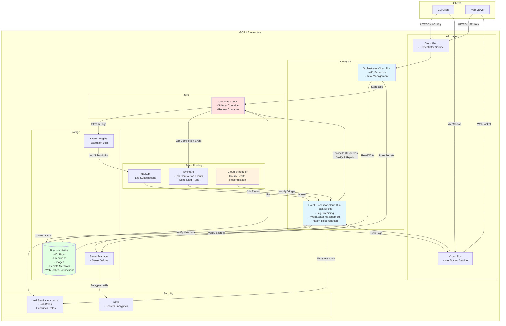

# GCP Architecture for runvoy

This document outlines the Google Cloud Platform (GCP) implementation architecture for runvoy, mirroring the AWS architecture while using GCP-native services.

## Architecture Overview

The following diagram shows the major GCP components and their interactions:



## Resource Mapping

| AWS Component | GCP Component | Purpose |
|---------------|---------------|---------|
| ECS Fargate Tasks | Cloud Run Jobs | Container execution environment |
| DynamoDB | Firestore (Native) | NoSQL database for metadata |
| Parameter Store | Secret Manager | Encrypted secret storage |
| EventBridge | Eventarc + Pub/Sub | Event routing and pub/sub |
| CloudWatch Logs | Cloud Logging | Log aggregation and storage |
| API Gateway WebSocket | Cloud Run (WebSocket) | WebSocket connections |
| CloudWatch Events | Cloud Scheduler | Scheduled event triggers |
| Lambda Functions | Cloud Run Services | Serverless compute |
| IAM Roles | IAM Service Accounts | Identity and access management |
| KMS | KMS | Encryption key management |

## Service Account Matrix

### Primary Service Accounts

| Service Account | Permissions | Purpose |
|-----------------|-------------|---------|
| `runvoy-orchestrator@{project}.iam.gserviceaccount.com` | Cloud Run Admin, Firestore User, Secret Manager Access, Cloud Run Jobs Developer | API request handling and task orchestration |
| `runvoy-processor@{project}.iam.gserviceaccount.com` | Cloud Run Admin, Firestore User, Pub/Sub Subscriber, Cloud Scheduler Admin | Event processing and health reconciliation |
| `runvoy-job@{project}.iam.gserviceaccount.com` | Secret Manager Access, Cloud Logging Writer | Job execution context (sidecar + runner) |

### Workload Identity Configuration

- **Cloud Run Services**: Use Workload Identity to impersonate service accounts
- **Cloud Run Jobs**: Use Workload Identity for job execution context
- **Service-to-Service**: All inter-service communication uses Workload Identity

## Environment Variables

### Core Configuration

```bash
# Backend Provider Selection
RUNVOY_BACKEND_PROVIDER=gcp

# GCP Project Configuration
RUNVOY_GCP_PROJECT_ID=my-gcp-project
RUNVOY_GCP_REGION=us-central1

# Service Configuration
RUNVOY_GCP_ORCHESTRATOR_SERVICE=runvoy-orchestrator
RUNVOY_GCP_PROCESSOR_SERVICE=runvoy-processor
RUNVOY_GCP_WEBSOCKET_SERVICE=runvoy-websocket

# Firestore Configuration
RUNVOY_GCP_FIRESTORE_DATABASE=runvoy
RUNVOY_GCP_FIRESTORE_COLLECTION_PREFIX=runvoy-

# Secret Manager Configuration
RUNVOY_GCP_SECRETS_PREFIX=runvoy-secrets
RUNVOY_GCP_SECRETS_KMS_KEY=projects/my-gcp-project/locations/global/keyRings/runvoy/cryptoKeys/secrets

# Cloud Run Jobs Configuration
RUNVOY_GCP_JOB_DEFAULT_REGION=us-central1
RUNVOY_GCP_JOB_DEFAULT_SERVICE_ACCOUNT=runvoy-job@my-gcp-project.iam.gserviceaccount.com
RUNVOY_GCP_JOB_DEFAULT_RUNTIME=python39

# Eventarc Configuration
RUNVOY_GCP_EVENTARC_TOPIC=runvoy-events
RUNVOY_GCP_PUBSUB_LOGS_TOPIC=runvoy-logs

# Cloud Scheduler Configuration
RUNVOY_GCP_HEALTH_RECONCILE_SCHEDULE=0 * * * *
```

### Optional Configuration

```bash
# Artifact Registry (if using custom images)
RUNVOY_GCP_ARTIFACT_REGISTRY_REPO=runvoy-images

# VPC Configuration (if private networking needed)
RUNVOY_GCP_VPC_CONNECTOR=runvoy-connector
RUNVOY_GCP_VPC_EGRESS=private-ranges-only

# Monitoring and Observability
RUNVOY_GCP_OBSERVABILITY_ENABLED=true
RUNVOY_GCP_METRICS_NAMESPACE=runvoy
```

## Implementation Phases

### Phase 1: Design & docs ✅
- [x] Draft GCP architecture and IAM matrix
- [x] Document env vars and provider identifier `gcp`
- [x] Create this architecture document

### Phase 2: Config & scaffolding
- [ ] Add `internal/config/gcp` with validation
- [ ] Allow `RUNVOY_BACKEND_PROVIDER=gcp`
- [ ] Scaffold `internal/providers/gcp/*` with stubs
- [ ] Ensure builds pass

### Phase 3: Persistence plus users/secrets
- [ ] Implement Firestore repositories
- [ ] Implement Secret Manager repository
- [ ] Enable `/users` and `/secrets` endpoints
- [ ] Add unit tests

### Phase 4: Minimal `/run` (no logs yet)
- [ ] Implement Cloud Run Jobs TaskManager
- [ ] Persist executions in Firestore
- [ ] Keep LogManager/WebSocketManager as no-ops
- [ ] Configure job defaults

### Phase 5: Completion and status updates
- [ ] Wire GCP processor via Eventarc
- [ ] Update execution status/timestamps
- [ ] Clean up expired tokens/log buffers
- [ ] Complete execution repo methods

### Phase 6: Logs and realtime
- [ ] Create Cloud Logging sink → Pub/Sub
- [ ] Implement LogManager
- [ ] Extend processor for log events
- [ ] Implement WebSocketManager

### Phase 7: Health and observability
- [ ] Implement GCP HealthManager
- [ ] Add ObservabilityManager
- [ ] Schedule reconciliation via Cloud Scheduler
- [ ] Add Cloud Monitoring metrics

## Key Design Decisions

### Firestore Native Mode
- **Choice**: Firestore Native over Datastore mode
- **Rationale**: Better performance, stronger consistency, native GCP integration
- **Collections**: Mirror DynamoDB table structure with collection prefixes

### Cloud Run Jobs vs Cloud Run Services
- **Jobs**: For one-off command executions (equivalent to ECS tasks)
- **Services**: For long-running orchestrator/processor (equivalent to Lambda)
- **Workload Identity**: Used for both jobs and services

### Eventarc + Pub/Sub Hybrid
- **Eventarc**: For Cloud Run Job state change events
- **Pub/Sub**: For log streaming and custom events
- **Rationale**: Eventarc has better native integration for job events

### Secret Manager Integration
- **Values**: Stored in Secret Manager (encrypted with KMS)
- **Metadata**: Stored in Firestore (similar to DynamoDB pattern)
- **Access**: Workload Identity for service-to-service access

### WebSocket Implementation
- **Approach**: Cloud Run with WebSocket support
- **Alternative**: Could use API Gateway WebSocket, but Cloud Run is simpler
- **Connection Management**: Firestore for connection metadata

## Security Considerations

### IAM Least Privilege
- Service accounts have minimal required permissions
- Workload Identity used for all service-to-service communication
- No long-lived service account keys

### Encryption
- Secret Manager uses KMS for encryption
- Firestore uses Google-managed encryption by default
- Customer-managed encryption keys available if needed

### Network Security
- Cloud Run services are private by default
- VPC connector available for private egress if needed
- IAM controls all access to GCP resources

## Operational Considerations

### Scaling
- Cloud Run Services: Auto-scale based on request volume
- Cloud Run Jobs: Scale based on job submissions
- Firestore: Scales automatically with usage

### Monitoring
- Cloud Monitoring for metrics and alerts
- Cloud Logging for log aggregation
- Cloud Trace for request tracing

### Cost Management
- Pay-per-use model for all services
- No minimum compute commitments
- Firestore pricing based on storage and operations

### Regional Deployment
- All services deployed in single region for consistency
- Multi-region deployment possible but adds complexity
- Firestore native mode provides strong consistency within region