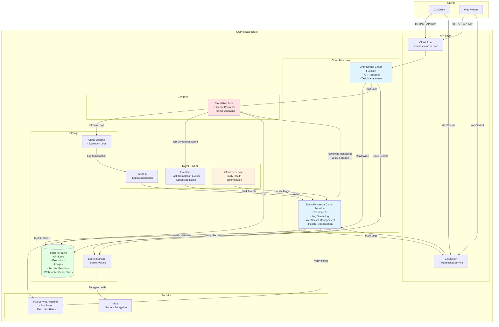

# GCP Architecture for runvoy

This document outlines the Google Cloud Platform (GCP) implementation architecture for runvoy, mirroring the AWS architecture while using GCP-native services.

## Architecture Overview

The following diagram shows the major GCP components and their interactions:



## Resource Mapping

| AWS Component | GCP Component | Purpose |
|---------------|---------------|---------|
| ECS Fargate Tasks | Cloud Run Jobs | Container execution environment |
| DynamoDB | Firestore (Native) | NoSQL database for metadata |
| Parameter Store | Secret Manager | Encrypted secret storage |
| EventBridge | Eventarc + Pub/Sub | Event routing and processing |
| CloudWatch Logs | Cloud Logging | Log aggregation and storage |
| API Gateway WebSocket | Cloud Run (WebSocket) | WebSocket endpoint management |
| CloudWatch Events | Cloud Scheduler | Scheduled event triggers |
| Lambda Functions | Cloud Functions | Serverless compute for orchestration/processing |
| IAM Roles | IAM Service Accounts | Identity and access management |
| KMS | Cloud KMS | Encryption key management |

## Service Account Architecture

### Core Service Accounts

1. **Orchestrator Service Account**
   - Permissions: Firestore read/write, Secret Manager access, Cloud Run Jobs execution
   - Used by: Orchestrator Cloud Function/Cloud Run

2. **Event Processor Service Account**
   - Permissions: Firestore read/write, Pub/Sub subscriptions, Cloud Run Jobs status
   - Used by: Event Processor Cloud Function

3. **Job Execution Service Account**
   - Permissions: Secret Manager access (secrets only), Cloud Logging write
   - Used by: Cloud Run Jobs during execution

4. **WebSocket Service Account**
   - Permissions: Firestore read/write (connections), Cloud Run management
   - Used by: WebSocket Cloud Run service

### IAM Permissions Matrix

| Service Account | Firestore | Secret Manager | Cloud Run Jobs | Pub/Sub | Cloud Logging |
|-----------------|-----------|----------------|----------------|---------|---------------|
| Orchestrator | ✅ Read/Write | ✅ Read/Write | ✅ Execute | ❌ | ✅ Write |
| Event Processor | ✅ Read/Write | ✅ Read | ✅ Get/List | ✅ Subscribe | ✅ Read |
| Job Execution | ❌ | ✅ Read (secrets only) | ❌ | ❌ | ✅ Write |
| WebSocket | ✅ Read/Write (connections) | ❌ | ✅ Manage | ❌ | ✅ Write |

## Environment Variables

### Core Configuration

```bash
# Backend provider selection
RUNVOY_BACKEND_PROVIDER=gcp

# GCP Project and Region
RUNVOY_GCP_PROJECT_ID=my-project
RUNVOY_GCP_REGION=us-central1

# Firestore Configuration
RUNVOY_GCP_FIRESTORE_DATABASE=runvoy-db
RUNVOY_GCP_FIRESTORE_COLLECTION_PREFIX=runvoy

# Secret Manager Configuration
RUNVOY_GCP_SECRETS_PREFIX=runvoy-secrets
RUNVOY_GCP_SECRETS_KMS_KEY_NAME=projects/my-project/locations/us-central1/keyRings/runvoy/cryptoKeys/secrets

# Cloud Run Jobs Configuration
RUNVOY_GCP_CLOUDRUN_REGION=us-central1
RUNVOY_GCP_CLOUDRUN_EXECUTION_SERVICE_ACCOUNT=runvoy-job-executor@my-project.iam.gserviceaccount.com
RUNVOY_GCP_CLOUDRUN_ORCHESTRATOR_SERVICE_ACCOUNT=runvoy-orchestrator@my-project.iam.gserviceaccount.com

# Pub/Sub Configuration
RUNVOY_GCP_PUBSUB_TOPIC=runvoy-events
RUNVOY_GCP_PUBSUB_SUBSCRIPTION=runvoy-events-sub

# Cloud Logging Configuration
RUNVOY_GCP_LOGGING_NAME=runvoy
```

## Implementation Phases

### Phase 1: Design & docs ✅
- [x] Draft GCP architecture and IAM matrix
- [x] Document env vars and provider identifier `gcp`
- [x] Create this architecture document

### Phase 2: Config & scaffolding
- [ ] Add `internal/config/gcp` with validation
- [ ] Allow `RUNVOY_BACKEND_PROVIDER=gcp`
- [ ] Scaffold `internal/providers/gcp/*` with stubs
- [ ] Ensure builds pass

### Phase 3: Persistence plus users/secrets
- [ ] Implement Firestore repositories
- [ ] Implement Secret Manager repository
- [ ] Enable `/users` and `/secrets` endpoints
- [ ] Add unit tests

### Phase 4: Minimal /run (no logs yet)
- [ ] Implement Cloud Run Jobs TaskManager
- [ ] Persist executions in Firestore
- [ ] Keep LogManager/WebSocketManager as no-ops
- [ ] Configure job defaults

### Phase 5: Completion and status updates
- [ ] Wire GCP processor via Eventarc
- [ ] Update execution status in Firestore
- [ ] Complete execution repo methods

### Phase 6: Logs and realtime
- [ ] Create Cloud Logging sink → Pub/Sub
- [ ] Implement LogManager
- [ ] Extend processor for log events
- [ ] Implement WebSocketManager

### Phase 7: Health and observability
- [ ] Implement GCP HealthManager
- [ ] Add ObservabilityManager
- [ ] Schedule reconciliation via Cloud Scheduler

## Key Design Decisions

### Firestore Native Mode
- Uses Firestore Native mode for maximum performance and scalability
- Collections follow naming pattern: `{prefix}_{resource_type}`
- TTL indexes for pending tokens and log buffers

### Cloud Run Jobs for Execution
- Cloud Run Jobs provide serverless container execution
- Sidecar pattern mirrors AWS ECS implementation
- Jobs are managed programmatically via Cloud Run Jobs API

### Event-Driven Architecture
- Eventarc handles Cloud Run Job state changes
- Pub/Sub transports log events and other async messages
- Cloud Scheduler triggers periodic health reconciliation

### Security Model
- Workload Identity for service account management
- KMS-managed encryption keys for secret encryption
- Minimal permissions following principle of least privilege

### Observability
- Cloud Logging for centralized log management
- Cloud Monitoring for metrics and health checks
- Structured logging with request tracing

## Networking Considerations

### Public vs Private Networking
- Default: Public networking for simplicity
- Optional: VPC connector for private egress if needed
- Cloud Run services accessible via HTTPS endpoints

### Service Discovery
- Cloud Run services use stable endpoint URLs
- Firestore and Secret Manager accessed via regional endpoints
- Pub/Sub topics/subscriptions for internal messaging

## Cost Optimization

### Serverless-First Approach
- Pay-per-use pricing model
- No idle infrastructure costs
- Automatic scaling based on demand

### Resource Management
- TTL indexes for automatic cleanup
- Event-driven processing (no polling)
- Efficient resource utilization via Cloud Run Jobs

## Migration Strategy

### Coexistence with AWS
- Provider selection via configuration
- Shared business logic, provider-specific implementations
- Gradual migration per environment

### Data Migration
- Export DynamoDB data to Firestore format
- Migrate secrets from Parameter Store to Secret Manager
- Update IAM permissions and service accounts

## Operational Considerations

### Deployment
- Terraform or gcloud CLI for infrastructure provisioning
- Cloud Build for CI/CD pipelines
- Artifact Registry for container images

### Monitoring
- Cloud Monitoring dashboards for system health
- Cloud Logging for log analysis and troubleshooting
- Error reporting for proactive issue detection

### Backup and Disaster Recovery
- Firestore automatic backups and point-in-time recovery
- Secret Manager regional replication
- Cloud Run job retry policies for resilience